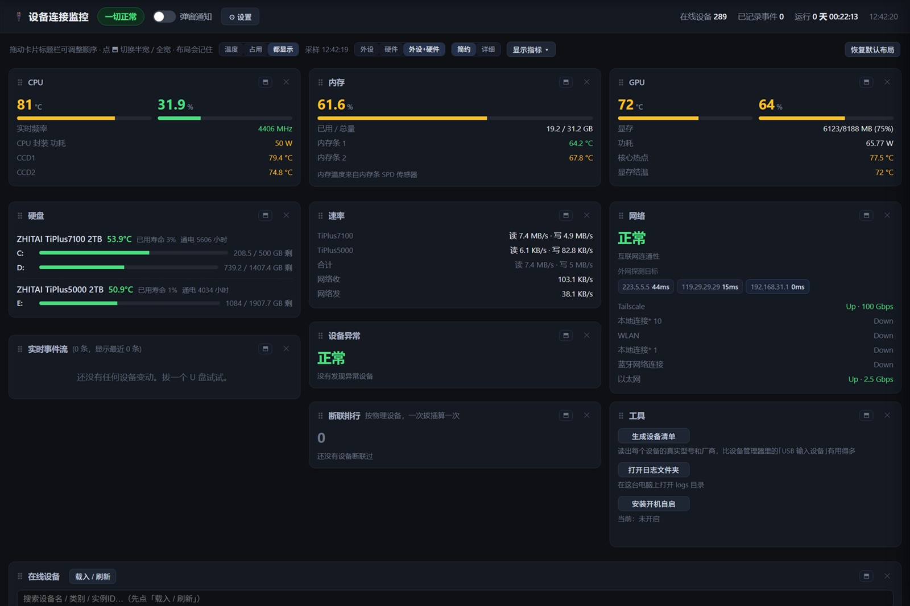

# 断联哨兵 LinkSentinel

7×24 盯着 Windows 上的设备接入和断开。断开的那一刻弹窗提醒，并把同一时间点的系统日志硬件错误
记在一起 —— 是线材、接口、供电还是驱动的问题，对着时间线就能看出来。

顺带采集 CPU / 内存 / GPU / 硬盘的状态，全部显示在一个本地网页上。



## 快速开始

下载 `断联哨兵.exe`，双击。**就一个文件，不需要安装任何东西，也不需要额外的 DLL。**

会启动监控、右下角出现托盘图标、自动打开浏览器面板。

## 它做什么

### 记录每一次接入和断开

- 精确到毫秒记进日志，同时弹窗 + 提示音
- 同一物理设备的多个接口节点合并成一条通知（拔一次鼠标是一条，不是八条）
- 短时间内有 3 台以上设备一起掉 → 提示可能是集线器复位或供电不足
- 把同一时间点的系统日志硬件错误也记进来，方便对照

```
21:03:11.482  [断联] USB 输入设备  <USB\VID_046D&PID_C534\...>（本次已连接 2.1 小时）
21:03:12.900  [接入] USB 输入设备  <USB\VID_046D&PID_C534\...>
21:05:40.118  [系统日志/存储控制器] 错误 (storahci) ID=129  重置了设备 \Device\RaidPort0
21:07:02.331  [网卡] 以太网 变为 Disconnected  0 bps
```

### 看清每个设备到底是什么

系统里同一只鼠标常常被拆成四五个节点，名字都叫「USB 输入设备」，光看日志分不出谁是谁。

在网页「工具」卡片点**生成设备清单**（或运行 `断联哨兵.exe inventory`），
会读取设备**自己上报的型号名**，生成一份可读的清单：

```
【一】USB 设备（含集线器）—— 按 VID/PID 分组，标出厂商
      VID_046D  Logitech          Logitech USB Receiver
      VID_8087  Intel             Intel(R) 无线 Bluetooth(R)
      VID_05E3  Genesys Logic     USB 2.0 Hub

【二】有故障码的设备（设备管理器里显示为黄色感叹号的那些）

【三】全部设备明细，含完整实例 ID
```

有了型号名，日志里那句「USB 输入设备断开」才知道指的是谁。

### 断联排行

网页上按设备统计断联次数，次数最多的最值得检查。

### 硬件状态

| 部件 | 内容 |
|---|---|
| CPU | 温度、各 CCD 温度、占用、实时频率、封装功耗 |
| 内存 | 占用、每根内存条温度 |
| GPU | 温度、核心热点、显存结温、占用、功耗、显存 |
| 硬盘 | 每块物理盘的温度 / 寿命 / 通电时长 / 分区读写速率 |
| 网络 | 实时速率、适配器状态、外网连通性 |
| 其它 | 电压、电池、开机时长 |

## 网页面板

本地网页 `http://127.0.0.1:8787`，监控启动后自动打开。

- **监测范围**：外设 / 硬件 / 外设+硬件，随时切换
- **所有设置都在网页上改**，不用编辑配置文件
- 卡片可拖动排序、调整宽度、隐藏
- 「工具」卡片：生成设备清单、打开日志文件夹、装/卸开机自启

## 命令行

| 命令 | 作用 |
|---|---|
| `断联哨兵.exe` | 启动 + 打开网页 |
| `断联哨兵.exe silent` | 启动但不打开网页（开机自启用的就是这个） |
| `断联哨兵.exe stop` | 停止监控 |
| `断联哨兵.exe web` | 只打开网页 |
| `断联哨兵.exe log` | 打开日志文件夹 |
| `断联哨兵.exe autostart` | 安装开机自启（开机不弹提示） |
| `断联哨兵.exe noautostart` | 取消开机自启 |
| `断联哨兵.exe debug` | 带控制台窗口启动，排查问题用 |
| `断联哨兵.exe noelevate` | 不提权启动（读不到内存温度 / CPU 功耗） |
| `断联哨兵.exe inventory` | 生成设备清单 |

## 常见问题

**双击后什么都没发生？**
等两秒，首次启动要初始化硬件采集。还是没有就运行 `断联哨兵.exe debug`，会开窗口显示详细报错。

**Windows 提示"未知发布者"？**
exe 没有代码签名（签名证书要付费），点"仍要运行"即可。源码全部公开，可以自己编译。

**杀毒软件报警？**
程序需要管理员权限读内存温度和 CPU 功耗，并会加载一个开源的签名驱动（LibreHardwareMonitor，MPL-2.0），
这两件事都可能触发安全软件的提示，加进信任区即可。

**没有内存温度 / CPU 功耗？**
这两项需要管理员权限。检查 UAC 是否被拒绝。

**网页连不上？**
监控没在运行。双击 `断联哨兵.exe`。

**想省点 CPU？**
网页 →「设置」→「采集」，把各项采集间隔调大。设备插拔检测走独立快速路径，不受影响。

**只想盯外设，不要硬件？**
网页工具栏点「外设」，硬件采样会完全停掉，内存也会降下来。

## 运行开销

| 项目 | 数值 |
|---|---|
| CPU | 约 0.17%（整机） |
| 内存 | 约 96 MB |
| 启动 | 约 1.7 秒 |
| 线程 / 句柄 | 21 / 707 |
| 插拔检测延迟 | 约 600 毫秒 |

切到「外设」模式不加载硬件子系统和低层传感器，内存还能再降。

## 自己编译

需要 .NET SDK（只有编译要用）。产物是单文件 exe，运行只需要系统自带的 .NET Framework 4.8。

```powershell
.\build.ps1          # 构建，产物输出到根目录
.\build.ps1 -Run     # 构建完顺便启动
```

> `lib\` 目录里的 12 个 DLL 会在编译时内嵌进 exe，所以发布出去只有 1 个文件。

## 系统要求

Windows 10 / 11 **x64**，.NET Framework 4.8（系统自带）。

## 许可

MIT，见 [LICENSE](LICENSE)。

内嵌的 DLL 来自 [LibreHardwareMonitor](https://github.com/LibreHardwareMonitor/LibreHardwareMonitor)（MPL-2.0），
以未修改的二进制形式分发，详见 [THIRD-PARTY.md](THIRD-PARTY.md)。